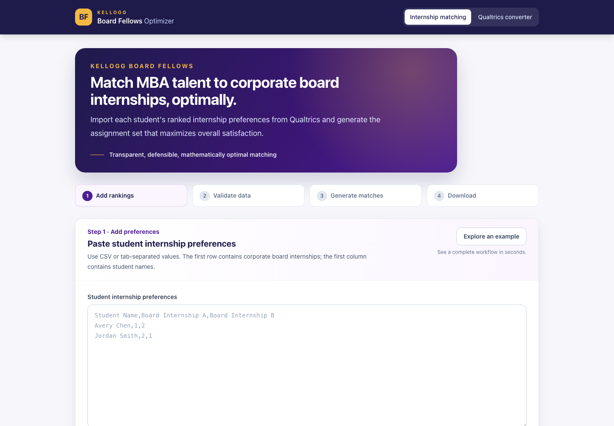

# Kellogg Board Fellows Optimizer

A browser-based tool for Kellogg Board Fellows administrators to match MBA students with corporate board internships according to their ranked preferences.



## What it does

Students submit a Qualtrics survey ranking up to 10 corporate board internships. The tool converts that survey export into a preference matrix and uses the [Hungarian algorithm](https://en.wikipedia.org/wiki/Hungarian_algorithm) to find the assignment set with the highest possible overall preference satisfaction.

This replaces a time-consuming, manual Excel-based matching process with a transparent result that is mathematically optimal for the submitted rankings.

## Workflow

1. Export the Qualtrics survey results as a CSV, including all fields and choice text.
2. Open the **Qualtrics converter** and paste the export.
3. Confirm the student-ID column, question-text row, and first data row.
4. Copy the generated student preference matrix.
5. Open **Internship matching**, paste the matrix, and select **Generate optimal matches**.
6. Review satisfaction metrics and download the assignment CSV.

The **Explore an example** button generates a fresh realistic demo each time: 10 students, 12 internships, ranked top-10 preferences, and overlapping first choices.

## Development

```sh
npm install
npm run dev
```

Create a production build with:

```sh
npm run build
```

## Deployment

The project includes a Surge deployment script. With the Surge CLI available and authenticated, run:

```sh
npm run deploy
```

This builds the app, publishes the contents of `dist` to `kbfmatcher.surge.sh`, and returns to the project root.

## Technology

- Vue 3 Composition API and Vue Router
- Vite and Tailwind CSS
- Web Workers for off-main-thread optimization
- `munkres-js`, an implementation of the Hungarian algorithm
- Papa Parse for CSV processing

## Program and project links

- [Kellogg Golub Capital Board Fellows Program](https://www.kellogg.northwestern.edu/academics-research/golub-capital-board-fellows/)
- [Project repository](https://github.com/nrrb/internship-matcher)

Written and maintained by Nicholas Bennett.
